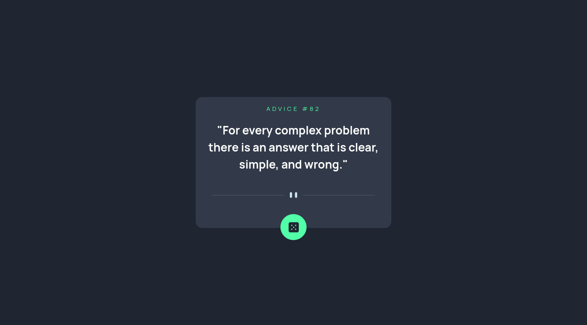

# Frontend Mentor - Advice generator app solution

This is a solution to the [Advice generator app challenge on Frontend Mentor](https://www.frontendmentor.io/challenges/advice-generator-app-QdUG-13db). Frontend Mentor challenges help you improve your coding skills by building realistic projects.

## Table of contents

- [Overview](#overview)
  - [The challenge](#the-challenge)
  - [Screenshot](#screenshot)
  - [Links](#links)
- [My process](#my-process)
  - [Built with](#built-with)
  - [What I learned](#what-i-learned)
  - [Continued development](#continued-development)
  - [Useful resources](#useful-resources)
- [Author](#author)
- [Acknowledgments](#acknowledgments)

**Note: Delete this note and update the table of contents based on what sections you keep.**

## Overview

### The challenge

Users should be able to:

- View the optimal layout for the app depending on their device's screen size
- See hover states for all interactive elements on the page
- Generate a new piece of advice by clicking the dice icon

### Screenshot

### Links

- Solution URL: [Add solution URL here](https://github.com/ttsoares/advices-api)
- Live Site URL: [Add live site URL here](https://advices-api.vercel.app/)

## My process

### Built with

- Flexbox
- Typescript
- Mobile-first workflow
- [React](https://reactjs.org/) - JS library
- [Next.js](https://nextjs.org/) - React framework
- [tailwindCSS](https://tailwindcss.com/) - For styles

### What I learned

- First FEM challenge with Typescript. From now one will do only with that.

### Continued development

- With backend Typescript is a must... Now will force myself to pleases TS with React.

### Useful resources

- [Typescript in React](https://www.youtube.com/watch?v=TPACABQTHvM) - Typing your way in the frontend.
- [Tutorial TS/React](https://www.youtube.com/watch?v=TiSGujM22OI&list=PLC3y8-rFHvwi1AXijGTKM0BKtHzVC-LSK&index=1)

## Author

- Website - [Thomas Tschoepke Soares](https://www.linkedin.com/in/thomas-soares-6791781b/)
- Frontend Mentor - [@ttsoares](https://www.frontendmentor.io/profile/ttsoares)

## Acknowledgments

Course from Udemy: "Advanced Typescript for React - Type React Apps that Scale"
